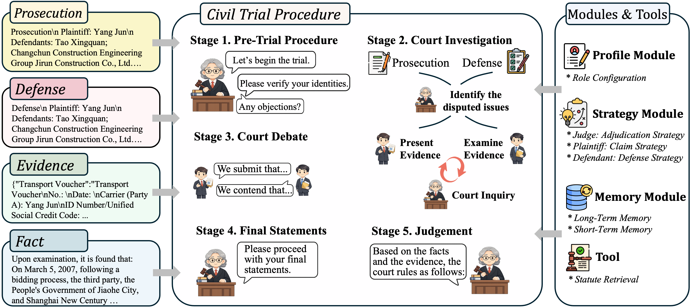

<div align="center">

# Civil Court Simulation with Large Language Models

[](https://arxiv.org/abs/2606.09632)

</div>

## Overview

Civil Court is an LLM-based simulation framework for Chinese civil cases. It assigns separate language-model agents to the judge, plaintiff, and defendant, and organizes their interaction according to a structured court procedure:

1. Pre-trial preparation
2. Court investigation
3. Court debate
4. Final statements
5. Judgment

The framework also retrieves relevant legal provisions from a local law library and records the complete simulation process in structured JSON files.

<p align="center">
  
</p>

This repository contains the core civil court simulation framework released with our paper. The paper additionally studies factors that may influence court simulation.

## Installation

Clone the repository and install the dependencies:

```bash
git clone https://github.com/foggpoy/Civil-Court.git
cd Civil-Court
pip install -r requirements.txt
```

The framework requires Python 3.10 or later and an OpenAI-compatible chat and embedding API.

## API Configuration

For a single OpenAI-compatible endpoint shared by all agents:

```bash
export OPENAI_BASE_URL="https://your-api-endpoint/v1"
export OPENAI_API_KEY="your-api-key"
```

Different endpoints or keys can optionally be assigned to individual components:

```bash
export JUDGE_BASE_URL="https://your-judge-endpoint/v1"
export JUDGE_API_KEY="your-judge-api-key"

export PLAINTIFF_BASE_URL="https://your-plaintiff-endpoint/v1"
export PLAINTIFF_API_KEY="your-plaintiff-api-key"

export DEFENDANT_BASE_URL="https://your-defendant-endpoint/v1"
export DEFENDANT_API_KEY="your-defendant-api-key"

export SUMMARY_BASE_URL="https://your-summary-endpoint/v1"
export SUMMARY_API_KEY="your-summary-api-key"

export EMBEDDING_BASE_URL="https://your-embedding-endpoint/v1"
export EMBEDDING_API_KEY="your-embedding-api-key"
```

Role-specific settings override `OPENAI_BASE_URL` and `OPENAI_API_KEY`. Keep real credentials in environment variables or an untracked `.env` file.

## Run

Run one case by its zero-based index:

```bash
python run.py 0 0 \
  --judge-model your-judge-model \
  --plaintiff-model your-plaintiff-model \
  --defendant-model your-defendant-model \
  --summary-model your-summary-model \
  --embedding-model your-embedding-model
```

Run a range of cases using inclusive start and end indices:

```bash
python run.py 0 4 \
  --judge-model your-judge-model \
  --plaintiff-model your-party-model \
  --defendant-model your-party-model \
  --summary-model your-summary-model \
  --embedding-model your-embedding-model
```

The shell wrapper can also be used:

```bash
bash run.sh 0 4 \
  --judge-model your-judge-model \
  --plaintiff-model your-party-model \
  --defendant-model your-party-model \
  --summary-model your-summary-model \
  --embedding-model your-embedding-model
```

For compatible providers, model-specific options such as reasoning and streaming can be enabled:

```bash
python run.py 0 0 \
  --judge-enable-thinking true \
  --judge-stream true
```

## Data and Outputs

- `data/selected_cases.jsonl`: civil cases used as simulation inputs.
- `data/law_library.jsonl`: legal provisions used for retrieval.
- `prompt/`: prompts and role profiles for the judge, plaintiff, and defendant.
- `output/<timestamp>/config.json`: non-sensitive run configuration.
- `output/<timestamp>/case_<id>.json`: complete stage-by-stage simulation record and judgment.

The law embedding matrix and FAISS index are generated on the first run and cached locally under `utils/`.

## Citation

If you find this repository useful, please cite our paper:

```bibtex
@misc{chen2026civilcourtsimulationlarge,
      title={Civil Court Simulation with Large Language Models}, 
      author={Yifan Chen and Haitao Li and Kaiyuan Zhang and Yueyue Wu and Qingyao Ai and Yiqun Liu},
      year={2026},
      eprint={2606.09632},
      archivePrefix={arXiv},
      primaryClass={cs.CL},
      url={https://arxiv.org/abs/2606.09632}, 
}
```
